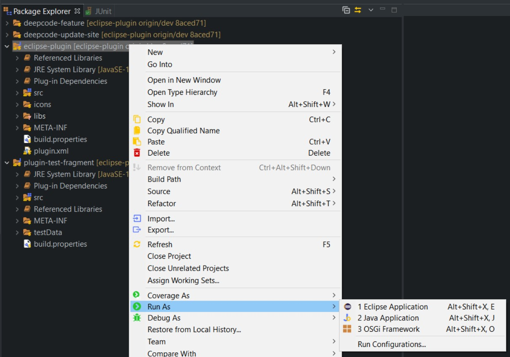

### Project structure
There are 4 depended projects here:
1. `eclipse-plugin` - actual source code for the plugin;
2. `deepcode-feature` - description and legal information about plugin, as well as some Eclipse required service wrappers;
3. `deepcode-update-site` - "update-site" to be given for Eclipse: Preferences - Install/Update - Available Software Sites;
4. `plugin-test-fragment` - tests for plugin.

Read more about Eclipse plugin concepts at official Eclipse [Plug-in Development Environment Guide](https://help.eclipse.org/2020-06/index.jsp?nav=%2F4_1) or in quick overview [Custom eclipse plugin | Build, create & publish to update site & marketplace](https://itsallbinary.com/custom-eclipse-plugin-build-create-publish-to-update-site-marketplace-good-for-beginners/) or the most recent [Eclipse IDE Plug-in Development: Plug-ins, Features, Update Sites and IDE Extensions](https://www.vogella.com/tutorials/EclipsePlugin/article.html)

### Build

- Clone this repository: `git clone https://github.com/DeepCodeAI/eclipse-plugin.git` and checkout desired branch;
- Place `java-client-{X.X.X}-all.jar` into `..\eclipse-plugin\libs` dir (see [java-client](https://github.com/DeepCodeAI/java-client) repository for instruction how to build it);
- Make sure [Eclipse IDE for Eclipse Committers](https://www.eclipse.org/downloads/packages/release/2020-06/r/eclipse-ide-eclipse-committers) installed along with Java 8 (preferably 11) or above;
- Open root `eclipse-plugin` Directory from `File - Open Projects from File System...` and make sure root dir is  __unselected__  as shown below:

After all steps in wizard you should have all 4 projects mentioned above opened in your Workbench.

See below correspondent `java-client` version requirements:

| eclipse-plugin   | java-client |
|------------------|-------------|
| 0.0.9            | 2.0.10      |
| 0.0.11           | 2.0.12      |

- Modify `.classpath` file inside `plugin-test-fragment` project to provide path to `java-client-{X.X.X}-all.jar` location;

Now you should be able to:
  * [modify and run plugin](https://www.vogella.com/tutorials/EclipsePlugin/article.html#runtimeeclipse_starting) itself at `eclipse-plugin` project:
  

   
  * update needed texts and version number at `deepcode-feature` project; 
  * Build it all into update-site in `deepcode-update-site` project;
  * For running tests use `plugin-test-fragment` project and in Package Explorer select the `Run As > JUnit Plug-in Test` command:
  

### Running tests
__To prevent tests be blocked__  by dialogs in UI (and the annoying Eclipse Window to pop up) during testing make sure the default test configuration is in ["headless mode"](https://stackoverflow.com/a/51748949/7577274)
You'll see some internal Exceptions due to absent of Eclipse GUI components, but all tests should pass correctly.

### Manual plugin Install
Production ready plugin should be available in Eclipse Marketplace (Help - Eclipse Marketplace...).

If you would like to add update-site manually (or add local version of update-site) then use this [tutorial](https://marketplace.eclipse.org/content/eclipse-java-development-tools-0/help) and add your local copy of update-site project or recent GitHub stored dev version of it: `https://raw.githubusercontent.com/DeepCodeAI/eclipse-plugin/dev/deepcode-update-site`

If you need to test modified plugin during development process - use `Run As - Eclipse Application` at your Eclipse IDE for Eclipse Committers (see [here](https://www.vogella.com/tutorials/EclipsePlugin/article.html#runtimeeclipse_starting)).

If you need to test pure plugin *.jar on another Eclipse IDE instance without updating feature and update-site you can use this trick [FAQ How do I install new plug-ins?](https://wiki.eclipse.org/FAQ_How_do_I_install_new_plug-ins%3F)

### JAR Signing

Before publishing following two jar files need to be signed inside `deepcode-update-site` project with `jarsigner` tool (see links below please):

`deepcode-update-site/features/ai.deepcode.feature_{X.X.X}.jar`

`deepcode-update-site/plugins/ai.deepcode_{X.X.X}.jar`

[Quick signing tutorial](https://stackoverflow.com/questions/17187520/signing-jar-file)
[Formal Oracle doc](https://wiki.eclipse.org/JAR_Signing)

### Useful links

- official Eclipse [Platform Plug-in Developer Guide](https://help.eclipse.org/2020-06/index.jsp?nav=%2F2), in particular:
  * [Platform architecture](https://help.eclipse.org/2020-06/index.jsp?topic=%2Forg.eclipse.platform.doc.isv%2Fguide%2Farch.htm&cp%3D2_0_1)
  * [Eclipse Platform API Specification](https://help.eclipse.org/2020-06/index.jsp?topic=%2Forg.eclipse.platform.doc.isv%2Freference%2Fapi%2Findex.html)
- official Eclipse [Plug-in Development Environment Guide](https://help.eclipse.org/2020-06/index.jsp?nav=%2F4)
- [The Official Eclipse FAQs](https://wiki.eclipse.org/The_Official_Eclipse_FAQs)

