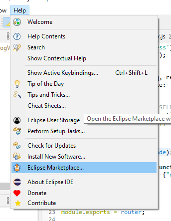
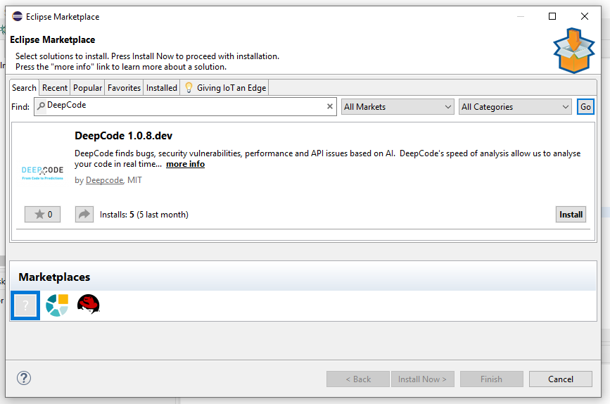
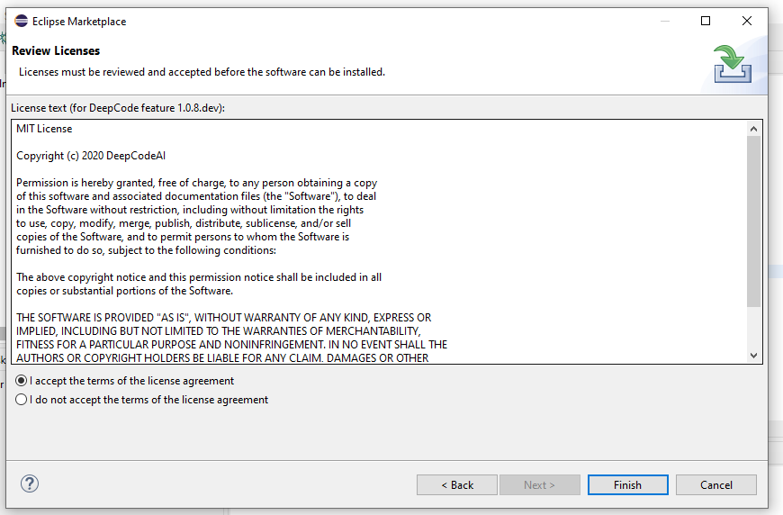
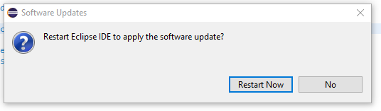
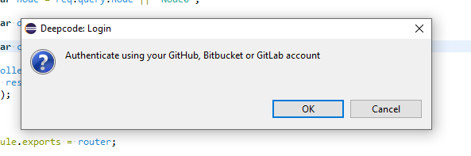
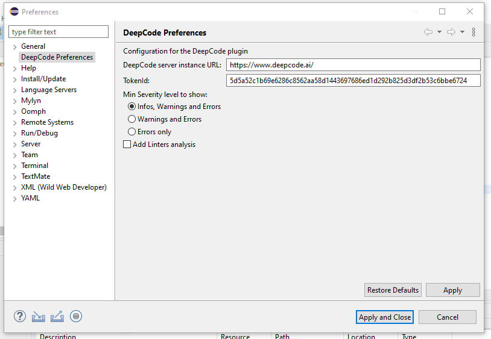
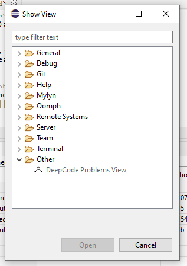
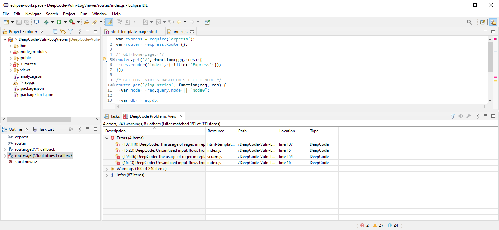
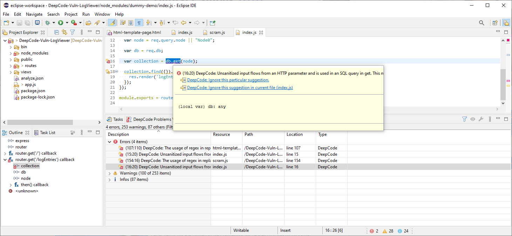

# Deepcode plugin for IDE "Eclipse"

# DeepCode extension

Through the extension you can quickly start using DeepCode's code review and analysis within your development workflow. The extension will automatically alert you about critical vulnerabilities you need to solve in your code the moment when you hit _Save_ in your IDE. With DeepCode's superior code review you save time finding and fixing bugs before they go to production. 

## DeepCode's AI Engine finds bugs

DeepCode uses symbolic AI to process hundreds of millions of commits in open source software projects and learns how to find serious coding issues. Because the platform determines the intent of the code � and not only the syntax mistakes � DeepCode identifies 10x more critical bugs and security vulnerabilities than other tools. 

## Our AI provides explanation behind found bugs

In order to show the detailed explanation of a potential bug, we introduced a new AI technique called _Ontology_. With Ontology, we�ve integrated the capability to present logical argumentation used by the DeepCode engine. 

## Supported languages and Platforms

JavaScript, TypeScript, Java, C/C++, and Python are currently supported. We supprt Eclipse 2019-03 and later.

# Installation

The installation is pretty straight forward. The DeepCode plug in is available on the [Eclipse Marketplace](https://marketplace.eclipse.org/content/deepcode#group-details). You can either follow the steps below or simply click on this button here: 

## Installation Steps
 
_Side Note:_ Make sure to have Eclipse 2019-03 or later. You can check under _Help_ - _About Eclipse_ - _Version_.

(1) Open the Eclipse Marketplace within Eclipse under _Help_ - _Eclipse Marketplace_:
 

(2) Search for _DeepCode_ by typing it into the search bar and pressing _Go_: 
 

_Side Note:_ When you do not find DeepCode, make sure you selected the Eclipse Marketplace in the Marketplace selectors.

(3) Click _Install_ on the bottom right of the entry.

(4) Eclipse will ask to accept the MIT license of DeepCode. Click on _I accept_ and _Finish_:

 

(5) Finally, restart Eclipse - done

 

## Authenticate to DeepCode Online Service

When starting the first time or when your API key has been deleted or invalidated, the DeepCode plugin will ask you to authenticate.

 

You will be redirected to a web browser and asked to login using either Github, Gitlab, or Bitbucket account. In the background, a key will be generated and stored to be used in the future.

# How to use it?

## Configuration

Under _Windows_ - _Preferences_ you will find the _DeepCode Preferences_ entry:

 

_DeepCode Server instance URL_ Per default, the DeepCode public internet facing server instance is chosen. But, if you have a DeepCode Docker instance running, you can target your internal instance by using this entry. Just enter the address of your internal server.

_TokenId_ is the token that was either acquired by the process described above or manually on the DeepCode dashboard. When deleting this entry, you force the plugin into the token acquisition. 

_Min Severity level to show_ offers the opportunity to dial down on the suggestions you get.

_Add Linters analysis_ DeepCode offers to add linter feedback like ESLint. You might have this in your IDE already and don't want to duplicate results.

## Usage

_Side Note:_ You can find the DeepCode in _Window_ - _Show View_ - _Other_

Opening a new project will ask you for approval to scan the project. You will then see the results displayed in the bottom bar of Eclipse.

As you can see on the bottom here, our project has two severe, 27 Warnings, and 24 Infos. You can click on the bottom info to open the _Problems View_. Clicking on the arrow symbol collapses or expands the list of suggestions and you see some information like filename, path, location line displayed in the table.

On the top right of the view, you can find a bar with symbols. First, there is a filter funnel. By clicking on the funnel, the filters window opens and you can define the type, the scope of issues you want to see listed. You can also define filters on the Description text.

_Side Note:_ Eclipse does not show when a filter is applied. Make sure to check from time to time so you do not accidentially filter out important information.

Next in line is the eye shaped icon (_Run full analysis_), which triggers a re-analysis of your project.

Next is the wrench icon (_Preferences_), which opens the preferences window as explained above.

The three dots in a vertical line (_Open Results in Browser_), opens the DeepCode dashboard for your project on the assigned DeepCode server. 

_Side Note:_ DeepCode caches the results for 24h and then regularly purges the cache. If the last scan is older than 24h, the results might no longer be present. Simply rescan (using the eye icon).

The last two icons are to minimize and maximize the view window.

When you hover over a suggestion in your code, the following overlay is shown:

Beside giving you results and context, DeepCode provides two options to add a comment to ignore this particular suggestion. Either for this specific incident or for the whole file. If you click on one of those, a short comment is inserted making DeepCode ignoring the specific suggestion and asking you to leave a comment for yourself or your colleagues on why you did this ignore.

# Feedback and contact

- In case you need to contact us or you want to provide feedback, we love to hear from you - [here is how to get in touch with us](https://www.deepcode.ai/feedback).
